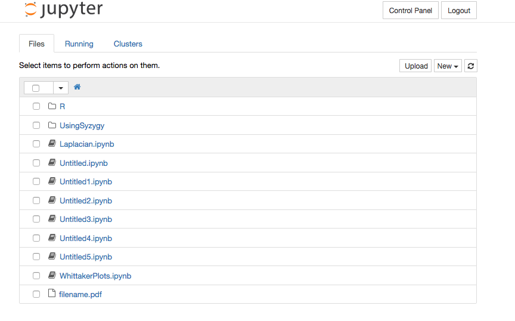
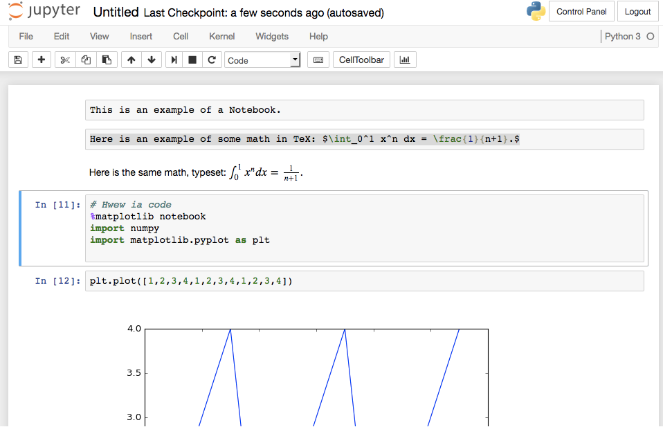

(basic-elements)=
# The Basic Elements

The 2i2c computing service is an implementation of the Jupyter Hub on
dedicated hardware accessible over the web. There is a great deal of information about Jupyter available at the Jupyter project [site](http://jupyter.org/)

There are four key concepts to master:

- the Hub
- the Notebook
- Markdown Language (in a Notebook)
- Computing (in a Notebook).

This chapter discusses all four.

## Using the Hub

Log into the [2i2c.org](https://2i2c.org/) service and clicking the button to "Start My Server."

The Hub is a page that lists all your files and folders. It looks like this:



As you can see, the Hub looks a lot like the list of files and folders you would see in the Finder on MacOS, or in the File Explorer in Windows.

At the top right corner of this front page is a "Control Panel" that lets you access your Jupyter server, to turn it on or off. Also is the logout button, to end your session.

The main body is the list of folders and files that you have on your server.

Click on a file or folder to open it. Use the checkbox on the left to select a file, then do something with it. For instance, you can choose to rename it, copy it, stop it from running, or delete it.

It is a good idea to create folders at the top level, to organize your work into usable spaces. It turns out it is hard to move a file once it is created. (More on this below.) So you should start by organizing your folders and files at the top level.

Near the top right, you see the upload button, which allows you to upload a file from your computer onto the Jupyter Hub. You can upload any file, including any data files or image files you might wish to analyse.

Also near the top right is the "New" button, which allows you to create a new folder or file. You can make text files, notebook files in Python, Julia or R, or open a Unix terminal window.

## Moving files between folders

It's not documented, but there is a way to move files and folders in and out of various folders directly from the Hub.

Select a file listed in the Hub by clicking on the square box at the left of the file's name. You are then given the option to "rename" the file. Click on the rename button, and then enter one of the following:

- `newname`  -- to give the file the new name
- `../oldname` -- to move the file up and out of the current folder, into the previous folder
- `foldername/oldname` -- to move the file into the folder called "foldername." This folder should already exist (because you created it earlier with a "new folder" command).

These renaming methods also work to move folders and their contents.

To move across several branches in the directory tree, you need to know the full path name of your files and where they are to go. This means you need to find out the name of your root tree structure. A fast way to do this is to use the magic command `%cd` in a notebook.

Open a notebook, click on an empty cell, and type `%cd`, hit shift-return. It will return the directory root name. Typically something like `/home/username` or `/home/usernumber`.

You can now use this to move a file into any folder. Just rename the file something like `/home/username/folderA/filename`. (the folderA better exist already, for you to move something into this.)

## Using Notebooks

From the Hub, you can click on a Notebook (a files with the suffix `.ipynb`) or create a new one with the "New" button. You need to pick a computing language (Python, Julia or R) when you create a new Notebook; for now, just choose **Python 3**.

The Notebook will look something like this.



At the top is the name of the notebook (in this case, "Untitled"). You can click on that name and edit it to whatever you like.

Just under the title is the menu bar, which allows you to do many things with the Notebook, including saving it, downloading it to your own computer, editing it, inserting new cells, and so on.

There is also an icon bar of menu short cuts. All of them are pretty obvious.

Below the menu controls is the Notebook content, which consists of a sequence of cells. Each cell can contain Markdown text or computer code. You select which kind of content for that cell from the little icon in the icon bar at the top.

In the example illustrated here, the first cell is just text. It says "This is an example of a Notebook." The second cell is Markdown text, including a math formula in LaTeX format. It starts "Here is an example of some math..."

The third cell shows the math formula as a real math formula, with an integral sign and all. The math is just typed in (like in the second cell), and then you hit "shift-return" on the keyboard to typeset the math.

The final few cells show some code, that loads in some plotting tools and makes a simple plot.

## Pretty Text and Math (Markdown Language)

One great feature of the Jupyter Notebooks is that they can contain formatted text, and mathematics, using the Markdown language.

Markdown is a rich language: a quick introduction to it is available [here](https://guides.github.com/features/mastering-markdown/).

Some quick points.

### Editing and typesetting

You simply type your text and Markdown symbols into a cell, and hit
"shift-return" to typeset the cell into pretty text (and math). Click on the cell again to undo the typesetting, so you can edit and fix your text. Make sure, of course, that you have marked the cell as "Markdown" and not "Code."

### Headers

Headers are made by starting the line with one or more hash marks \#.

\#### This is a level-4 header, in text form

#### This is the resulting header

### Emphasis

Add emphasis by surrounding text with asterix or underscores.

\*italics\* and \*\*bold\*\*:  *Italics* and **bold**

### Lists

Type this:

\* Apple
\* Orange
\* Pear

to get a list like this:

- Apple
- Orange
- Pear

### Web links

Type this: \[GitHub]([http://github.com](http://github.com)) to get a clickable link [GitHub](http://github.com)

### Mathematics

Use the dollar sign \$ to indicate the start and end of TeX code for your math.

```{math}
Here is a basic integral: $\int \cos(x) dx = \sin(x)$
```

Here is a basic integral: $$\int \cos(x) dx =
\sin(x)$$

### Images

Here is some code to embed an image from the web:

```markdown

```


